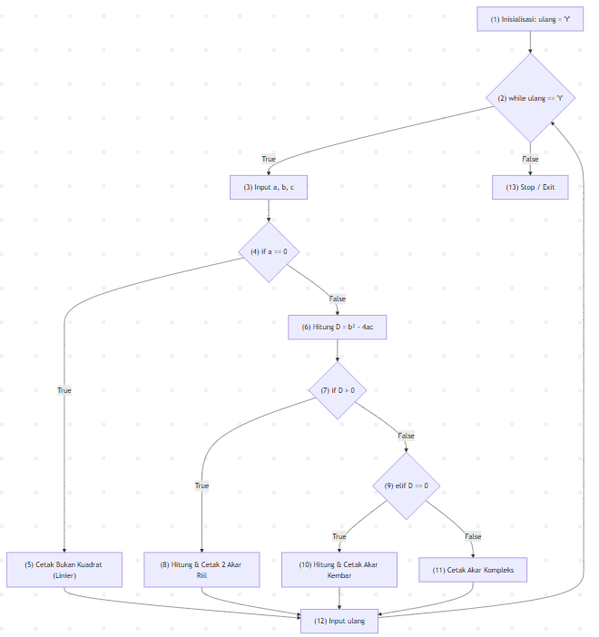

# Analisis White-Box Testing: Penyelesaian Persamaan Kuadrat

Dokumentasi analisis pengujian struktural (*White-Box Testing*) pada program penyelesaian persamaan kuadrat (\(ax^2 + bx + c = 0\)) dengan parameter pengukuran *Statement Coverage* (SC), *Branch Coverage* (BC), dan *Loop Coverage* (LC) mengacu pada paper Khairunnisya dkk. (EECSI 2017).

## Algoritma Program

1. Inisialisasi variabel perulangan ulang = 'Y'.
2. Evaluasi kondisi loop ulang == 'Y'. Jika tidak terpenuhi, program berhenti.
3. Baca nilai input koefisien a, b, dan c.
4. Evaluasi kondisi a == 0:
- Jika True: Cetak "Bukan persamaan kuadrat (Linier)".
- Jika False: Hitung nilai diskriminan $D = b^2 - 4ac$.
5. Evaluasi nilai diskriminan $D$:
- Jika D > 0: Hitung dan cetak dua akar riil berbeda ($x_1 \neq x_2$).
- Jika D == 0: Hitung dan cetak dua akar riil kembar ($x_1 = x_2$).
- Jika D < 0: Cetak "Akar kompleks / imajiner".
6. Minta input konfirmasi dari pengguna untuk mengulang program (ulang).Kembali ke evaluasi kondisi loop (Langkah 2).

## Kode Program & Pemetaan Simpul (Nodes)

```python
import math

(1)  ulang = "Y"
(2)  while ulang.upper() == "Y":
(3)      a = float(input("Masukkan a: "))
         b = float(input("Masukkan b: "))
         c = float(input("Masukkan c: "))
(4)      if a == 0:
(5)          print("Bukan persamaan kuadrat (Linier)")
         else:
(6)          D = (b ** 2) - (4 * a * c)
(7)          if D > 0:
(8)              x1 = (-b + math.sqrt(D)) / (2 * a)
                 x2 = (-b - math.sqrt(D)) / (2 * a)
                 print(f"Dua akar riil berbeda: {x1} dan {x2}")
(9)          elif D == 0:
(10)             x = -b / (2 * a)
                 print(f"Dua akar kembar: {x}")
             else:
(11)             print("Akar kompleks / imajiner")
(12)     ulang = input("Hitung lagi? (Y/N): ")
```

## Control Flow Graph (CFG)



## Cyclomatic Complexity & Jalur Independen (Basis Paths)

### Perhitungan Cyclomatic Complexity ($V(G)$):
- Berdasarkan Predicate Nodes ($P$):
Terdapat 3 simpul keputusan predikat: Node 2, Node 5, dan Node 7.
$$V(G) = P + 1 = 3 + 1 = 4$$
- Berdasarkan Edge ($E$) dan Node ($N$):
Jumlah Edge ($E$) = 11, Jumlah Node ($N$) = 9 (dengan menyatukan seluruh jalur keluar ke terminal Node 10).
$$V(G) = E - N + 2 = 11 - 9 + 2 = 4$$

### Daftar Independent Basis Paths:
- Path 1 (Data Kosong, lastName terisi): 1 - 2 - 4 - 5 - 6 - 10
- Path 2 (Data Kosong, lastName == null): 1 - 2 - 3 - 4 - 5 - 6 - 10
- Path 3 (Ditemukan Tepat 1 Data): 1 - 2 - 4 - 5 - 7 - 8 - 10
- Path 4 (Ditemukan Banyak Data): 1 - 2 - 4 - 5 - 7 - 9 - 10

## Rancangan Kasus Uji & Evaluasi Branch Coverage
