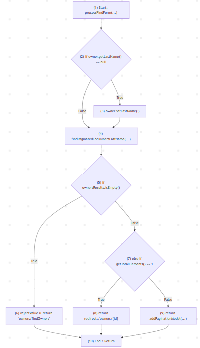

# 1. Analisis White-Box Testing: Penyelesaian Persamaan Kuadrat
Dokumentasi analisis pengujian struktural (*White-Box Testing*) pada program penyelesaian persamaan kuadrat (\(ax^2 + bx + c = 0\)) dengan parameter pengukuran *Statement Coverage* (SC), *Branch Coverage* (BC), dan *Loop Coverage* (LC) mengacu pada paper Khairunnisya dkk. (EECSI 2017).

## 1.1 Algoritma Program
1. Inisialisasi variabel perulangan ulang = 'Y'.
2. Evaluasi kondisi loop ulang == 'Y'. Jika tidak terpenuhi, program berhenti.
3. Baca nilai input koefisien a, b, dan c.
4. Evaluasi kondisi a == 0:
- Jika True: Cetak "Bukan persamaan kuadrat (Linier)".
- Jika False: Hitung nilai diskriminan $D = b^2 - 4ac$.
5. Evaluasi nilai diskriminan $D$:
- Jika D > 0: Hitung dan cetak dua akar riil berbeda ($x_1 \neq x_2$).
- Jika D == 0: Hitung dan cetak dua akar riil kembar ($x_1 = x_2$).
- Jika D < 0: Cetak "Akar kompleks / imajiner".
6. Minta input konfirmasi dari pengguna untuk mengulang program (ulang).Kembali ke evaluasi kondisi loop (Langkah 2).

## 1.2 Kode Program & Pemetaan Simpul (Nodes)
```python
import math

(1)  ulang = "Y"
(2)  while ulang.upper() == "Y":
(3)      a = float(input("Masukkan a: "))
         b = float(input("Masukkan b: "))
         c = float(input("Masukkan c: "))
(4)      if a == 0:
(5)          print("Bukan persamaan kuadrat (Linier)")
         else:
(6)          D = (b ** 2) - (4 * a * c)
(7)          if D > 0:
(8)              x1 = (-b + math.sqrt(D)) / (2 * a)
                 x2 = (-b - math.sqrt(D)) / (2 * a)
                 print(f"Dua akar riil berbeda: {x1} dan {x2}")
(9)          elif D == 0:
(10)             x = -b / (2 * a)
                 print(f"Dua akar kembar: {x}")
             else:
(11)             print("Akar kompleks / imajiner")
(12)     ulang = input("Hitung lagi? (Y/N): ")
```

## 1.3 Control Flow Graph (CFG)


## 1.4 Cyclomatic Complexity & Jalur Independen (Basis Paths)

### 1.4.1 Perhitungan Cyclomatic Complexity ($V(G)$):
- Metode 1: Predicate Nodes ($P$)
Terdapat 4 titik percabangan keputusan logika: Node 2, Node 4, Node 7, dan Node 9.
$$V(G) = P + 1 = 4 + 1 = 5$$
- Metode 2: Edge ($E$) dan Node ($N$)Jumlah Edge ($E$) = 16 alur, Jumlah Node ($N$) = 13 simpul.
$$V(G) = E - N + 2 = 16 - 13 + 2 = 5$$

### 1.4.2 Daftar Independent Basis Paths:
- Path 1 (Bypass Loop): 1 - 2 - 13
- Path 2 (Persamaan Linier / $a = 0$): 1 - 2 - 3 - 4 - 5 - 12 - 2 - 13
- Path 3 (Akar Riil Berbeda / $D > 0$): 1 - 2 - 3 - 4 - 6 - 7 - 8 - 12 - 2 - 13
- Path 4 (Akar Kembar / $D = 0$): 1 - 2 - 3 - 4 - 6 - 7 - 9 - 10 - 12 - 2 - 13
- Path 5 (Akar Imajiner / $D < 0$): 1 - 2 - 3 - 4 - 6 - 7 - 9 - 11 - 12 - 2 - 13

## 1.5 Rancangan Kasus Uji
| TC ID | Input (a,b,c) | Nilai Diskriminan (D) | Expected Result | Target Path | Status |
| :--- | :--- | :--- | :--- | :--- | :--- |
| **TC-01** | `a=0, b=2, c=4` | - | Bukan persamaan kuadrat (Linier) | Path 2 | **PASS** |
| **TC-02** | `a=1, b=−5, c=6` | \((-5)^2 - 4(1)(6) = 1\) | Dua akar riil berbeda (\(x_1=3, x_2=2\)) | Path 3 | **PASS** |
| **TC-03** | `a=1, b=−4, c=4` | \((-4)^2 - 4(1)(4) = 0\) | Dua akar kembar (\(x=2\)) | Path 4 | **PASS** |
| **TC-04** | `a=1, b=2, c=5` | \((2)^2 - 4(1)(5) = -16\) | Akar kompleks / imajiner | Path 5 | **PASS** |
| **TC-05** | Eksekusi TC-02 (`ulang='Y'`), lanjut TC-03 (`ulang='N'`) | - | Program berjalan 2 siklus loop lalu selesai | Path 3 → Path 4 → Path 1 | **PASS** |

## 1.6 Evaluasi Branch Coverage
| ID Cabang | Decision Node | Pernyataan Keputusan (Predicate) | Evaluasi | Alur Simpul (Edge) | Dieksekusi oleh | Kondisi Input Uji | Status Cakupan |
| :--- | :--- | :--- | :--- | :--- | :--- | :--- | :--- |
| **BR-01** | Node 2 | `while ulang.upper() == "Y"` | True | 2 → 3 | TC-01, TC-02, TC-03, TC-04, TC-05 | `ulang = "Y"` | Covered (100%) |
| **BR-02** | Node 2 | `while ulang.upper() == "Y"` | False | 2 → 13 | TC-05 | `ulang = "N"` (keluar loop) | Covered (100%) |
| **BR-03** | Node 4 | `if a == 0` | True | 4 → 5 | TC-01 | `a=0, b=2, c=4` | Covered (100%) |
| **BR-04** | Node 4 | `if a == 0` | False | 4 → 6 | TC-02, TC-03, TC-04 | \(a \neq 0\) (`a=1`) | Covered (100%) |
| **BR-05** | Node 7 | `if D > 0` | True | 7 → 8 | TC-02 | `a=1, b=−5, c=6` \(\rightarrow D=1\) | Covered (100%) |
| **BR-06** | Node 7 | `if D > 0` | False | 7 → 9 | TC-03, TC-04 | \(D \le 0\) (\(D=0\) atau \(D=-16\)) | Covered (100%) |
| **BR-07** | Node 9 | `elif D == 0` | True | 9 → 10 | TC-03 | `a=1, b=−4, c=4` \(\rightarrow D=0\) | Covered (100%) |
| **BR-08** | Node 9 | `elif D == 0` | False | 9 → 11 | TC-04 | `a=1, b=2, c=5` \(\rightarrow D=-16\) | Covered (100%) |

$$\text{Branch Coverage (BC)} = \frac{8 \text{ cabang tereksekusi}}{8 \text{ total cabang}} \times 100\% = \mathbf{100\%}$$

## 1.7 Evaluasi Metrik Cakupan
- Statement Coverage (SC): $13 / 13 \text{ simpul} = \mathbf{100\%}$   
- Branch Coverage (BC): $8 / 8 \text{ cabang keputusan} = \mathbf{100\%}$   
- Loop Coverage (LC): Mencakup kondisi $0$ iterasi (bypass loop), $1$ iterasi (TC-01 sampai 04), dan perulangan jamak $>1$ iterasi (TC-05) $= \mathbf{100\%}$.

# 2. Analisis Open-Source Project (Spring Framework)

## 2.1 Identifikasi Komponen & Target Repositori
- Repository Publik: [spring-projects/spring-petclinic](https://github.com/spring-projects/spring-petclinic)
- Package: org.springframework.samples.petclinic.owner
- File / Class: OwnerController.java
- Target Method: processFindForm (Method penanganan pencarian entitas Owner dengan multi-kondisi pencabangan).

## 2.2 Cuplikan Kode Sumber (Java) & Pemetaan Simpul (Nodes)
``` java
     @GetMapping("/owners")
(1)  public String processFindForm(@RequestParam(defaultValue = "1") int page, Owner owner, BindingResult result, Model model) {
(2)      if (owner.getLastName() == null) {
(3)          owner.setLastName(""); 
         }
(4)      Page ownersResults = findPaginatedForOwnersLastName(page, owner.getLastName());
(5)      if (ownersResults.isEmpty()) {
(6)          result.rejectValue("lastName", "notFound", "not found");
             return "owners/findOwners";
(7)      } else if (ownersResults.getTotalElements() == 1) {
(8)          owner = ownersResults.iterator().next();
             return "redirect:/owners/" + owner.getId();
         } else {
(9)          return addPaginationModel(page, model, ownersResults);
         }
(10)  }
```

## 2.3 Control Flow Graph (CFG)


## 2.4 Cyclomatic Complexity & Jalur Independen (Basis Paths)

### 2.4.1 Perhitungan Cyclomatic Complexity ($V(G)$):
- Metode 1: Predicate Nodes ($P$)Terdapat 3 simpul keputusan predikat: Node 2, Node 5, dan Node 7.
$$V(G) = P + 1 = 3 + 1 = 4$$
- Metode 2: Edge ($E$) dan Node ($N$)Jumlah Edge ($E$) = 11, Jumlah Node ($N$) = 9 (dengan mengarahkan semua cabang return ke Node 10).
$$V(G) = E - N + 2 = 11 - 9 + 2 = 4$$

### 2.4.2 Daftar Independent Basis Paths:
- Path 1 (Data Kosong, lastName terisi): 1 - 2 - 4 - 5 - 6 - 10
- Path 2 (Data Kosong, lastName == null): 1 - 2 - 3 - 4 - 5 - 6 - 10
- Path 3 (Ditemukan Tepat 1 Data): 1 - 2 - 4 - 5 - 7 - 8 - 10
- Path 4 (Ditemukan Banyak Data): 1 - 2 - 4 - 5 - 7 - 9 - 10

## 2.5 Rancangan Kasus Uji (Test Cases Suite)
| TC ID | Input owner.getLastName() | Kondisi Database (ownersResults) | Target Path | Output Return View | Status |
| :--- | :--- | :--- | :--- | :--- | :--- |
| **TC-01** | `"Franklin"` | Empty (0 data) | Path 1 | `"owners/findOwners"` | **PASS** |
| **TC-02** | `null` | Empty (0 data) | Path 2 | `"owners/findOwners"` | **PASS** |
| **TC-03** | `"Davis"` | Single Record (1 data) | Path 3 | `"redirect:/owners/2"` | **PASS** |
| **TC-04** | `""` | Multiple Records (>1 data) | Path 4 | `"owners/ownersList"` | **PASS** |

## 2.6 Tabel Analisis Branch Coverage (BC)
| ID Cabang | Decision Node | Pernyataan Keputusan (Predicate) | Evaluasi | Alur Simpul (Edge) | Dieksekusi oleh | Kondisi Input & Database | Status Cakupan |
| :--- | :--- | :--- | :--- | :--- | :--- | :--- | :--- |
| **BR-01** | Node 2 | `if (owner.getLastName() == null)` | True | 2 → 3 | TC-02 | `owner.getLastName() == null` | Covered (100%) |
| **BR-02** | Node 2 | `if (owner.getLastName() == null)` | False | 2 → 4 | TC-01, TC-03, TC-04 | `lastName` terisi (`"Franklin"`, `"Davis"`, `""`) | Covered (100%) |
| **BR-03** | Node 5 | `if (ownersResults.isEmpty())` | True | 5 → 6 | TC-01, TC-02 | Hasil query database kosong (0 data) | Covered (100%) |
| **BR-04** | Node 5 | `if (ownersResults.isEmpty())` | False | 5 → 7 | TC-03, TC-04 | Hasil query database tidak kosong (\(\ge 1\) data) | Covered (100%) |
| **BR-05** | Node 7 | `else if (ownersResults.getTotalElements() == 1)` | True | 7 → 8 | TC-03 | Total data database tepat 1 record | Covered (100%) |
| **BR-06** | Node 7 | `else if (ownersResults.getTotalElements() == 1)` | False | 7 → 9 | TC-04 | Total data database >1 record (multipel) | Covered (100%) |

$$\text{Branch Coverage (BC)} = \frac{6 \text{ cabang tereksekusi}}{6 \text{ total cabang}} \times 100\% = \mathbf{100\%}$$

## 2.7 Evaluasi Metrik Cakupan
- Statement Coverage (SC): $10 / 10 \text{ simpul} = \mathbf{100\%}$   
- Branch Coverage (BC): $6 / 6 \text{ cabang logika} = \mathbf{100\%}$